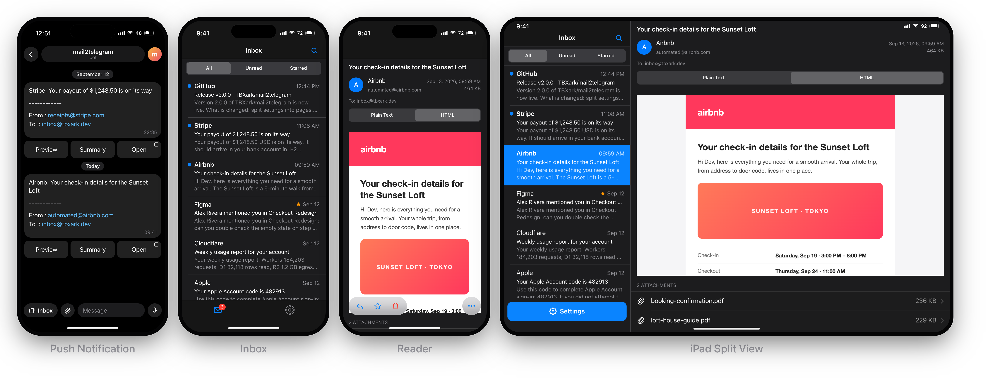

<h1 align="center">
mail2telegram
</h1>

<p align="center">
    <br> English | <a href="docs/README_CN.md">中文</a>
</p>
<p align="center">
    <em>Receive email in Telegram: instant push notifications plus a Mini App inbox.</em>
</p>
<p align="center">
    <a href="https://deploy.workers.cloudflare.com/?url=https://github.com/TBXark/mail2telegram"></a>
</p>

**mail2telegram** is a Telegram bot for receiving email, running entirely on [Cloudflare Workers](https://developers.cloudflare.com/workers/). It combines instant push notifications with a Telegram Mini App: every incoming email is pushed to your chat with quick action buttons, while the full history, attachments and every setting live in the Mini App. Mail arrives through [Cloudflare Email Routing](https://developers.cloudflare.com/email-service/get-started/route-emails/), which forwards every message to the worker, and AI summaries run on [Workers AI](https://developers.cloudflare.com/workers-ai/) or any OpenAI-compatible provider.




## How it works

```
Email ──▶ Telegram push with quick action buttons
      └─▶ Mini App inbox (history, attachments, settings)
```

- **Push notifications** carry quick action buttons per email: `Preview`, `Summary` and `Open`.
- **Mini App inbox** lists history per folder, renders HTML in a sandbox, downloads attachments, replies and composes new mail through Resend, and manages all settings.
- **Settings in the Mini App** include white/black lists with regex matching, an address tester, block policy, forwarding, AI summary options and mail handling limits.

All behavior is configured in the Mini App and stored in D1 — the worker itself only needs a few variables for its Telegram identity and optional API keys.

## Guides

- **Quick deploy** — [Deploy to Cloudflare](https://deploy.workers.cloudflare.com/?url=https://github.com/TBXark/mail2telegram) clones the repo, creates the D1 / R2 resources, asks for the Telegram values and deploys. Bind the bot and Email Routing afterwards.
- **[Deployment Guide](docs/DEPLOY.md)** ([中文](docs/DEPLOY_CN.md)) — install 2.0 from scratch: Telegram bot setup, D1 / R2 storage, deploying with the Deploy to Cloudflare button, Cloudflare Workers Builds, GitHub Actions or the CLI, runtime variables and Email Routing.
- **[Migration Guide](docs/MIGRATION.md)** ([中文](docs/MIGRATION_CN.md)) — upgrade an existing 1.0 deployment: what changed in 2.0, the step-by-step upgrade path and the variable mapping.

## Telegram Mini App

Open the Mini App from the bot with `/start`. The first `/start` from a chat also binds the webhook and points the bot menu button at the worker, so later opens can use the menu button directly. Everything below is managed inside the Mini App:

- **Inbox** — folders (Inbox / Spam / Trash / Sent), search, unread and starred filters, pull through history with "Load more".
- **Reader** — sandboxed HTML view with a plain text toggle, attachments, star/read/delete, AI summary and reply.
- **Settings** — white list, block list, address tester, block policy, forwarding, summary options and mail handling limits.

The Mini App is protected by Telegram `initData` validation against `TELEGRAM_TOKEN`, restricted to the IDs in `TELEGRAM_ID`. In a plain browser the same URL asks for `WEB_PASSWORD`; when no password is configured, the Mini App is the only way in and the project landing page is shown instead.

On phones the app uses a native tab bar and navigation stack. On desktop clients (macOS, Telegram Desktop) and wide viewports it switches to an iPad-style split view with a sidebar, list and reading pane.

## Usage

The push message structure is unchanged:

```
[Subject]

-----------
From : [sender]
To   : [recipient]

(Preview)(Summary)(Open)
```

1. `Preview` shows the plain text body directly in the chat, limited to 4096 characters.
2. `Summary` appears when a summary backend is enabled in Settings ([Workers AI](https://developers.cloudflare.com/workers-ai/), or an OpenAI-compatible provider).
3. `Open` launches the Mini App straight to this message's detail page. Telegram only allows Mini App buttons in private chats, so group notifications omit it.

Reply to any pushed message in Telegram to answer the sender through Resend.

> **CPU budget:** parsing a message costs roughly 2ms of CPU per MB, so keep `Max Size` under ~2MB on the Workers **free** plan (10ms CPU per request). The paid plan's 30s budget has no such constraint. See [Attachments](#attachments).

### Address lists

Rules are managed in the Mini App. A rule matches either an exact address (case-insensitive) or a regular expression. The white list takes precedence over the block list, so an allow rule can override a broad block rule for the same address.

### Attachments

Attachments are stored in R2 and listed in the reader, where they can be downloaded. If no `BUCKET` binding is configured, mail is still stored without attachment contents.

Attachments need the whole message, so `Max Size` in **Mail Handling** has to be at least as large as the mail you want to receive. Base64 encoding adds about a third to every attachment, so budget the limit around the largest file you expect. Mail over the limit has its body truncated, and because attachments follow the body in the message, a truncated mail stores no attachments at all — the alternative would be handing you a corrupt download. The oversize policy **Headers** avoids the problem differently by skipping the body altogether.

### Retention

Mail older than the retention setting is not part of the notification cache, but the full history remains until you delete it from the Mini App.

## Development

The repo is a pnpm workspace with three packages and the deployable worker config at the root:

| Path | Package | Contents |
|:-----|:--------|:---------|
| `packages/server` | `@mail2telegram/server` | Cloudflare Worker: email handlers, Telegram bot, Mini App API, D1 migrations and the Worker-runtime tests. |
| `packages/web` | `@mail2telegram/web` | Telegram Mini App (Vite + React), built to `packages/web/dist/client`. |
| `packages/shared` | `@mail2telegram/shared` | Types-only HTTP contract consumed by both sides; owns every type that crosses the wire. |

```bash
pnpm install
pnpm dev            # Vite dev server on :5173 + wrangler dev on :8787
pnpm build          # typecheck every package and build the Mini App into packages/web/dist/client
pnpm typecheck      # tsc --noEmit for each package
pnpm test           # pure-logic tests (tsx) + Worker-runtime tests (vitest, Miniflare)
pnpm test:unit      # mergeSettings / testAddress / parseEmail only
pnpm test:pool      # D1, inbound-email and cleanup tests in the Workers runtime
pnpm lint           # oxlint
pnpm lint:fix       # oxlint --fix
pnpm format         # oxfmt
pnpm format:check   # oxfmt --check (used by CI)
pnpm screenshots    # regenerate the README images in docs/assets from mock data
```

`wrangler dev` serves the built `packages/web/dist/client`, so run `pnpm build` (or keep `pnpm build:web` running) at least once before starting it; `pnpm dev` runs both processes but does not build the assets.

Local D1 migrations:

```bash
pnpm db:migrate:local
```

The Mini App normally requires a valid Telegram `initData` signature. For local development, put `WEB_PASSWORD=dev` (plus your bot values) in the gitignored `.dev.vars`, run `wrangler dev` and open `http://localhost:5173`, then sign in with that password — exactly how a browser session works in production. The `?debug` flag still mocks the Telegram UI (theme, viewport, platform) for previewing, and `?platform=ios` previews the phone layout in a desktop browser. Never set a real `WEB_PASSWORD` in anything but the deployed worker's variables.

## License

**mail2telegram** is released under the MIT license. [See LICENSE](LICENSE) for details.
